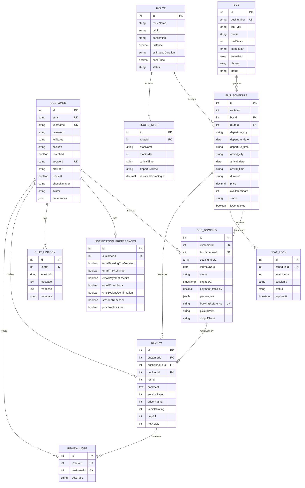
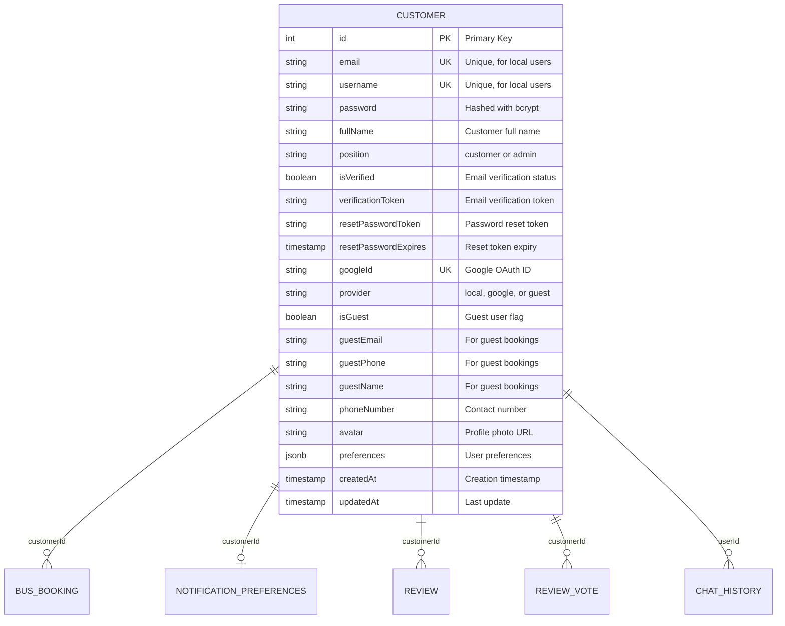
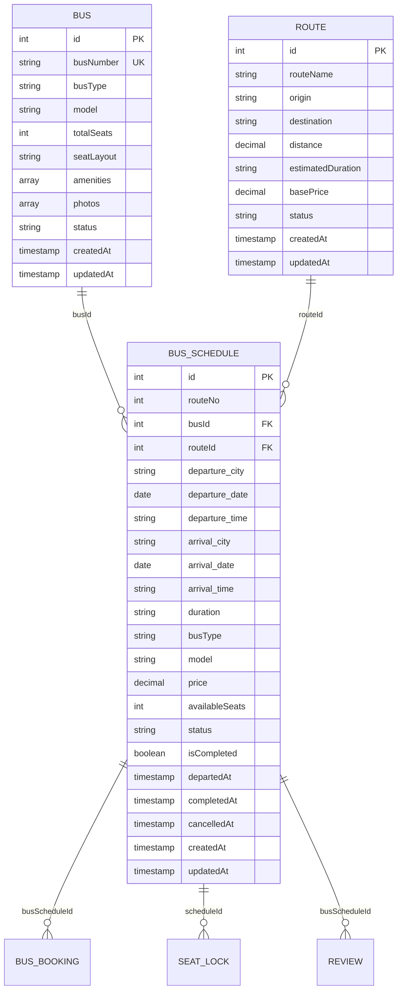
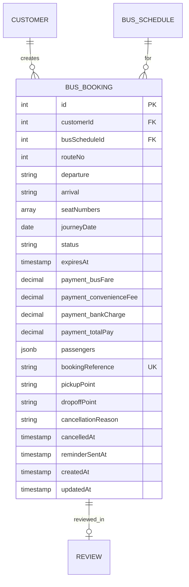
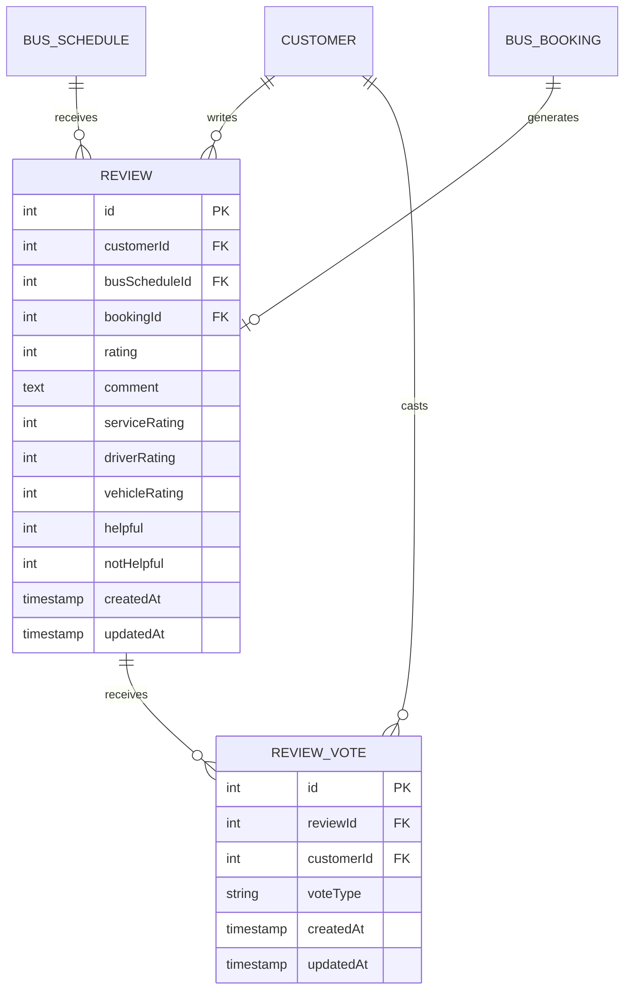
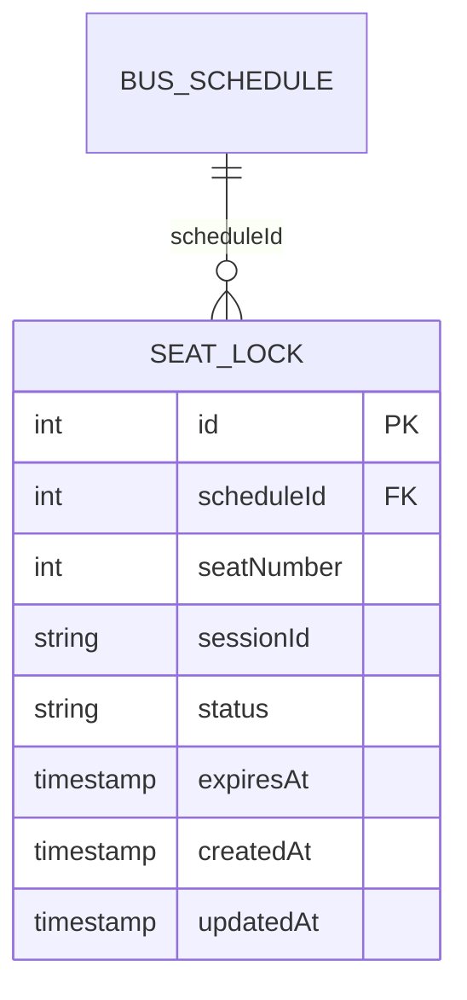
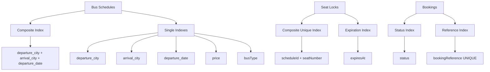
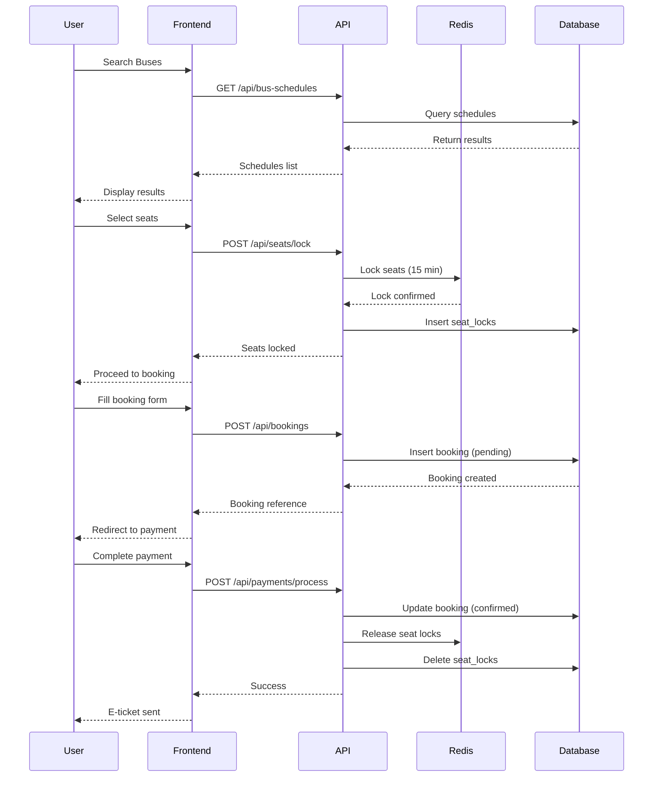
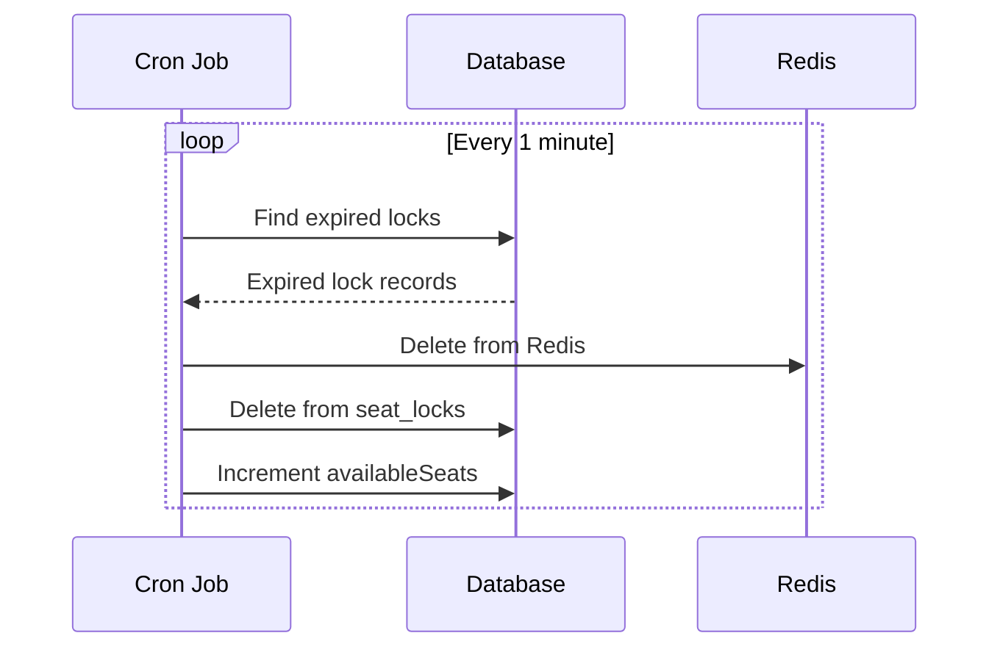
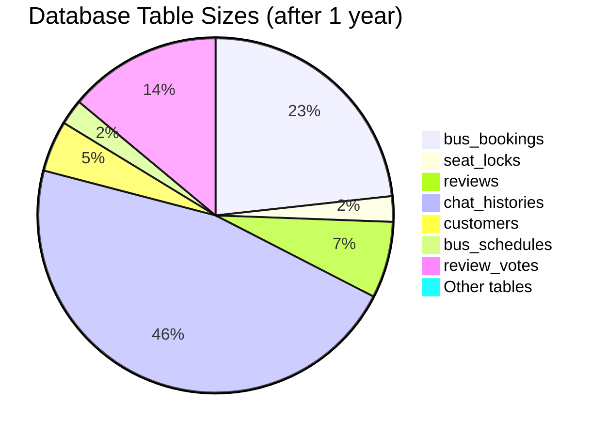

# 🗂️ Database ERD Diagrams

Visual database schema diagrams for the Bus Ticket Booking System.

## Entity Relationship Diagram

### Main Entities Overview



## Detailed Relationship Diagrams

### Customer and Authentication Module



### Bus Schedule and Booking Module



### Booking and Payment Flow



### Review and Rating System



### Seat Locking Mechanism



## Database Indexes Visualization

### Critical Indexes for Performance



## Data Flow Diagrams

### Booking Creation Flow



### Seat Lock Expiration Flow



## Table Size Estimates

### Estimated Data Growth (1 Year)



## Storage Requirements

### Estimated Storage (1 Year Operation)

| Table | Rows | Avg Size | Total Size |
|-------|------|----------|------------|
| customers | 100,000 | 1 KB | ~100 MB |
| bus_bookings | 500,000 | 2 KB | ~1 GB |
| seat_locks | 50,000 | 200 B | ~10 MB |
| reviews | 150,000 | 1 KB | ~150 MB |
| review_votes | 300,000 | 100 B | ~30 MB |
| chat_histories | 1,000,000 | 500 B | ~500 MB |
| bus_schedules | 50,000 | 500 B | ~25 MB |
| **Total** | | | **~2 GB** |

**Note:** Add 50-100% for indexes and PostgreSQL overhead = **~4-6 GB total**

## Maintenance Queries

### Useful Database Queries

```sql
-- Check table sizes
SELECT 
    schemaname,
    tablename,
    pg_size_pretty(pg_total_relation_size(schemaname||'.'||tablename)) AS size
FROM pg_tables
WHERE schemaname = 'public'
ORDER BY pg_total_relation_size(schemaname||'.'||tablename) DESC;

-- Find slow queries
SELECT 
    query,
    calls,
    total_time,
    mean_time,
    max_time
FROM pg_stat_statements
ORDER BY mean_time DESC
LIMIT 10;

-- Check index usage
SELECT 
    schemaname,
    tablename,
    indexname,
    idx_scan,
    idx_tup_read,
    idx_tup_fetch
FROM pg_stat_user_indexes
ORDER BY idx_scan DESC;

-- Find missing indexes
SELECT 
    schemaname,
    tablename,
    seq_scan,
    seq_tup_read,
    idx_scan,
    seq_tup_read / seq_scan AS avg
FROM pg_stat_user_tables
WHERE seq_scan > 0
ORDER BY seq_tup_read DESC
LIMIT 10;
```

---

**Note:** These diagrams are generated using Mermaid syntax and can be viewed in:
- GitHub (native support)
- VS Code with Mermaid extension
- Online Mermaid editors
- Documentation sites with Mermaid plugins

**Last Updated:** January 2, 2026
